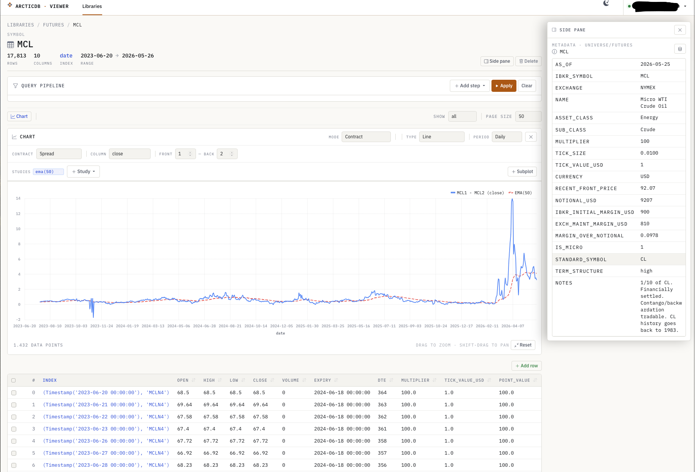
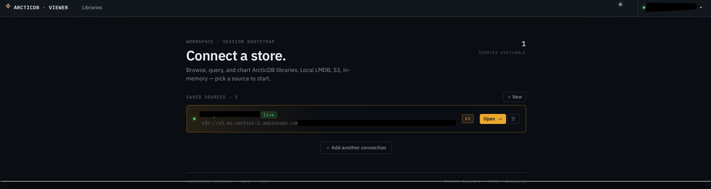
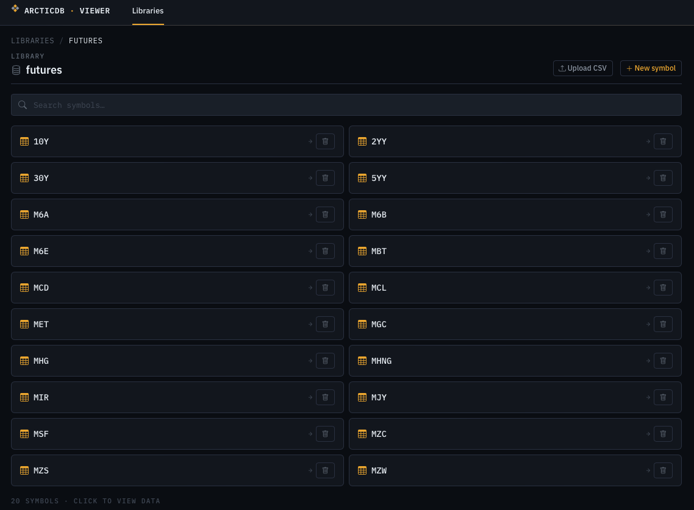

# ArcticDB Viewer

A web-based data browser and MCP server for [ArcticDB](https://arcticdb.io) — the serverless DataFrame database for Python.

Browse libraries and symbols, view and edit DataFrames with pagination, filtering, grouping, and charting. Includes an MCP server for LLM integration with Claude.



<sub>The data view: query pipeline, line/candlestick/bar charting with SMA/EMA studies, side-pane metadata from a `universe` library, and an editable paginated table. Dark and light themes — toggle from the navbar.</sub>

## Screenshots

| Connection picker (dark) | Symbol grid (dark) |
|---|---|
|  |  |

## Features

### Web UI
- **Connection manager** — connect to S3, LMDB (local), or in-memory backends. Auto-detects `.env` credentials
- **Library browser** — list, create, and delete libraries
- **Symbol browser** — list, search, create (with schema definition), delete, and upload CSV
- **DataFrame viewer** — paginated table with automatic column detection
- **Query builder** — stackable operations:
  - **Filter** — column/operator/value with support for `10^6`, `2.5e3`, `between`, `regex`
  - **Unique / Deduplicate** — keep first or last row per column
  - **Group & Aggregate** — group by column with last, first, mean, sum, count, min, max, median, std
  - **Sort** — by any column or index, also via clickable column headers
  - **Select columns** — toggle column visibility
  - **Limit rows** — show first/last N rows
- **Cell editing** — double-click to edit, Enter to confirm with undo option, ESC to cancel
- **Row management** — add new rows, select and delete multiple rows
- **Charting** — line, bar, scatter, and candlestick charts with subplot support (e.g. price + volume), SMA/EMA studies, drag-to-zoom, and a contract-aware mode for multi-index `(date, contract)` symbols: single rank, overlay, spread, plus continuous-series methods (unadjusted, back-adjusted Δ, back-adjusted ratio, perpetual) with configurable roll rules (expiry, calendar offset, volume crossover)
- **Dark + light themes** — sun/moon toggle in the navbar, preference persisted to localStorage

### MCP Server
10 tools for full ArcticDB CRUD via LLM:

| Tool | Description |
|------|-------------|
| `list_libraries` | List all libraries |
| `create_library` | Create a new library |
| `delete_library` | Delete a library |
| `list_symbols` | List symbols in a library |
| `describe_symbol` | Get metadata (rows, columns, dtypes) |
| `read_data` | Read data with pagination and column selection |
| `write_data` | Write CSV data to a symbol (overwrites) |
| `update_data` | Update rows in a date range |
| `append_data` | Append CSV rows to a symbol |
| `delete_symbol` | Delete a symbol |

## Installation

```bash
git clone https://github.com/YOUR_USERNAME/arcticdb-viewer.git
cd arcticdb-viewer
pip install -r requirements.txt
```

**Requirements:** Python 3.10+

## Quick Start

### 1. Configure connection

**Option A: Environment file** — create a `.env` file:
```
AWS_ACCESS_KEY_ID=your-key
AWS_SECRET_ACCESS_KEY=your-secret
BUCKET_NAME=your-bucket
AWS_REGION=us-east-1
```

**Option B: Web UI** — start the app and configure from the welcome page.

### 2. Start the web UI

```bash
python run_web.py
```

Open http://localhost:8000. If a `.env` is detected, you'll see it on the welcome page — click Connect.

### 3. Start the MCP server

```bash
# Local (stdio) — for Claude Desktop / Claude Code
python run_mcp.py --transport stdio

# Remote (SSE) — for network access
python run_mcp.py --transport sse --port 8001
```

The MCP server connects via `.env` automatically.

## MCP Setup

### Claude Desktop

Add to your `claude_desktop_config.json`:

```json
{
  "mcpServers": {
    "arcticdb": {
      "command": "python",
      "args": ["/absolute/path/to/arcticdb-viewer/run_mcp.py", "--transport", "stdio"]
    }
  }
}
```

On macOS: `~/Library/Application Support/Claude/claude_desktop_config.json`
On Windows: `%APPDATA%\Claude\claude_desktop_config.json`

### Claude Code

Add to your project's `.claude/settings.json` or global settings:

```json
{
  "mcpServers": {
    "arcticdb": {
      "command": "python",
      "args": ["/absolute/path/to/arcticdb-viewer/run_mcp.py", "--transport", "stdio"]
    }
  }
}
```

Or run directly:
```bash
claude mcp add arcticdb python /absolute/path/to/arcticdb-viewer/run_mcp.py -- --transport stdio
```

### Usage examples with Claude

Once configured, you can ask Claude:

- *"List all libraries in ArcticDB"*
- *"Show me the symbols in the market_data library"*
- *"Describe the us_equities symbol"*
- *"Read the first 10 rows of us_equities where Symbol is AAPL"*
- *"Create a new library called 'research'"*
- *"Write this CSV data to a symbol called 'signals' in the research library"*

## Architecture

```
core/                  Shared ArcticDB operations (pure Python)
  connection.py        ConnectionManager — multi-instance, saved to ~/.adbview/connections.json
  operations.py        All CRUD functions (single source of truth)

web/                   FastAPI + Jinja2 + HTMX + Bootstrap 5
  app.py               App setup, connection middleware
  routes/              connections, libraries, symbols, data
  templates/           Server-rendered HTML with HTMX partials

mcp_server/            MCP server (mcp package)
  server.py            10 tools, stdio + SSE transport

run_web.py             Web UI entry point (uvicorn, port 8000)
run_mcp.py             MCP server entry point
```

Both the web UI and MCP server share `core/operations.py` — all ArcticDB access goes through this single layer.

## Supported Backends

| Backend | URI format | Notes |
|---------|-----------|-------|
| **S3** | `s3s://s3.region.amazonaws.com:bucket?region=X&access=Y&secret=Z` | AWS, MinIO, etc. |
| **S3 (AWS auth)** | `s3s://endpoint:bucket?aws_auth=true` | Uses `~/.aws/credentials` |
| **LMDB** | `lmdb:///path/to/database` | Local file-based storage |
| **In-memory** | `mem://` | Testing only, data lost on restart |

## Tech Stack

- **Backend:** FastAPI, ArcticDB, pandas
- **Frontend:** Jinja2 templates, HTMX, Bootstrap 5.3 with `data-bs-theme` dark/light switching, Chart.js, IBM Plex Sans + Mono
- **MCP:** mcp package (FastMCP), stdio + SSE transport
- **No JavaScript build step** — all frontend dependencies via CDN

## License

MIT
